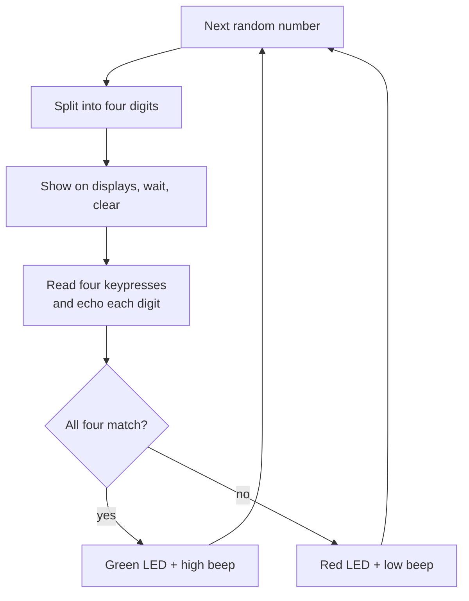

# MU0 Memory Game

A four-digit memory game written in assembly for **MU0**, the minimal 16-bit processor the University of Manchester uses to teach how computers work from the gates up.

The board flashes a random number on its 7-segment displays, then hides it. You type it back on the keypad, one digit at a time. Get it right and the green LED flashes with a bright beep. Get it wrong and you get the red LED and a lower, sadder one. Then it deals you a new number.

I wrote it in my first year at Manchester. The fun part was the constraint: a game with random numbers, input, a display and sound, on a processor that can't multiply, divide or call a function.

## Working with eight instructions

MU0 has a 4-bit opcode and a 12-bit address, which leaves room for eight instructions and 4K words of memory:

| Instruction | Does |
|---|---|
| `LDA x` | Load the accumulator from address `x` |
| `STA x` | Store the accumulator to `x` |
| `ADD x`, `SUB x` | Add or subtract the value at `x` |
| `JMP x` | Jump |
| `JGE x` | Jump if the accumulator is zero or positive |
| `JNE x` | Jump if the accumulator isn't zero |
| `STP` | Stop |

There are no immediate values either, so every constant the game needs (0 to 9, 10, 100, 1000, the keypad masks, the LED bits and the buzzer tones) lives in a data table in memory.

## How it works

- **Random numbers.** A simple additive generator: each round adds a fixed step (`&CD`) to a seed (`&ABC`).
- **Digits without division.** The thousands digit is how many times 1000 can be subtracted before the result goes negative (`SUB` then `JGE`). The same again for hundreds and tens, and what's left is the units.
- **Timing.** The display delay and the LED flash are nested countdown loops: an inner count from `&FFFF` repeated four times.
- **Reading the keypad.** Poll until a key is down, remember its value, then wait for release before moving on. Waiting for release is what stops one press from being read as four.
- **Decoding keys.** Each key is one bit in the keypad word (key 0 is `&0001`, key 9 is `&0200`), so the decoder compares against the ten masks in turn, stores the digit and echoes it to that display.
- **Checking.** The four digits are compared in order, and the first mismatch jumps straight to the lose path.

### Why the key decoder appears four times

With no call and return, and no indirect addressing, a routine can't be told which display or variable to write to. The usual workaround is self-modifying code, which saves space but is much harder to follow and debug. This version unrolls the decoder once per digit instead: more code, but each digit's path reads top to bottom.

## Memory map

| Address | Contents |
|---|---|
| `&000` onwards | Program |
| `&450` onwards | Data: target and entered digits, working variables, constants |
| `&FF2` | Keypad (read) |
| `&FF5` to `&FF8` | 7-segment displays, units to thousands |
| `&FFD` | Buzzer |
| `&FFF` | LEDs |

## Run it

1. Assemble `memory_game.s` with the MU0 assembler in the university's lab toolchain.
2. Load it onto an MU0 board (or the simulator) and run from address `&000`.

`memory_game.s.kmd` is the assembled listing, with every instruction's address and machine code next to the source line, handy for stepping through on the board.

## Known limitations

- **The generator isn't bounded to four digits.** The seed only ever grows, so from round 36 it passes 9,999 and the thousands "digit" goes above 9. After about 147 rounds the value passes `&7FFF` and reads as negative, so the digit extraction stops working. The fix is one more step after updating the seed: subtract 10,000 and keep the result if it's still zero or positive.
- **Same sequence every time.** The seed is fixed, so every reset replays the same numbers. Timing the player's first keypress would be a cheap source of randomness.
- **Pressing two keys at once** doesn't match any mask and is read as 0.

## Files

| File | What's in it |
|---|---|
| `memory_game.s` | Source, commented |
| `memory_game.s.kmd` | Assembled listing with addresses, machine code and the symbol table |
