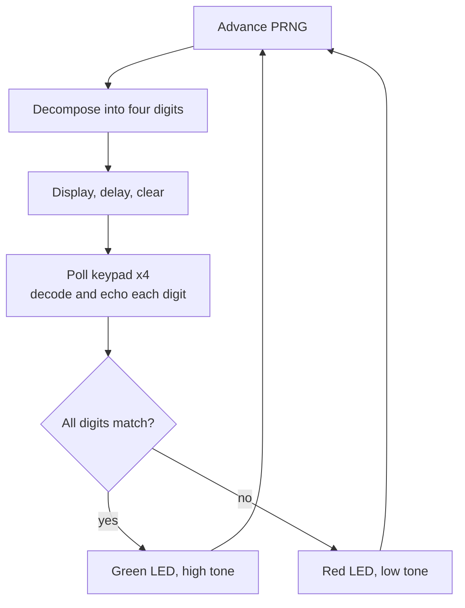

# MU0 Memory Game

A four-digit memory game in MU0 assembly, using the board's keypad, 7-segment displays, LEDs and buzzer.

## Overview

MU0 is a minimal 16-bit accumulator architecture used at the University of Manchester to teach processor design. This program implements an interactive game on the MU0 development board: it displays a pseudo-random four-digit number, clears it after a fixed interval, reads the player's four keypresses, and signals the result with the LEDs and buzzer.

The program was written for a first-year computer engineering module. It demonstrates arithmetic, memory-mapped I/O, polling and timing on an instruction set with no multiply, divide, immediate operands, indirect addressing or subroutine linkage.

## Contents

- [Gameplay](#gameplay)
- [Target architecture](#target-architecture)
- [Implementation](#implementation)
- [Memory map](#memory-map)
- [Building and running](#building-and-running)
- [Known limitations](#known-limitations)
- [Repository contents](#repository-contents)

## Gameplay

1. A four-digit number is shown on the displays.
2. After a fixed delay the displays clear.
3. The player enters the number on the keypad, most significant digit first. Each digit is echoed as it is entered.
4. A correct entry lights the green LED with a high tone; an incorrect entry lights the red LED with a low tone.
5. A new round begins.

## Target architecture

MU0 uses a 4-bit opcode and a 12-bit address field, giving eight instructions and a 4K-word address space.

| Instruction | Operation |
|---|---|
| `LDA S` | ACC ← mem[S] |
| `STA S` | mem[S] ← ACC |
| `ADD S` | ACC ← ACC + mem[S] |
| `SUB S` | ACC ← ACC − mem[S] |
| `JMP S` | PC ← S |
| `JGE S` | If ACC ≥ 0, PC ← S |
| `JNE S` | If ACC ≠ 0, PC ← S |
| `STP` | Halt |

Because there are no immediate operands, every constant used by the program (digits 0 to 9, powers of ten, keypad masks, LED bit patterns and buzzer tones) is stored in a data table.

## Implementation

| Stage | Technique |
|---|---|
| Pseudo-random numbers | Additive sequence: the seed (initially `&0ABC`) is incremented by `&00CD` each round. |
| Digit decomposition | Repeated subtraction of 1000, 100 and 10, using `SUB` and `JGE` to detect underflow, in place of division. |
| Timing | Nested countdown loops: an inner count from `&FFFF` repeated four times for both the display interval and the feedback flash. |
| Keypad input | Busy-wait until the keypad word is non-zero, latch the value, then wait for release so a single press is not read more than once. |
| Key decoding | The keypad is one-hot (key *n* sets bit *n*), so each value is compared against ten masks in sequence. |
| Validation | Digits are compared from most to least significant; the first mismatch branches to the failure path. |

### Design trade-off: unrolled decoding

Without subroutine linkage or indirect addressing, a routine cannot be parameterised with the destination display or variable. The common alternative is self-modifying code, which reduces program size at the cost of readability and debuggability. This implementation instead unrolls the decoder once per digit position, trading code size for four independent, linear control paths.

## Memory map

| Address | Contents |
|---|---|
| `&000` | Program entry point and code |
| `&450` | Data: target and entered digits, working variables, constant table |
| `&FF2` | Keypad input |
| `&FF5` to `&FF8` | 7-segment displays (units to thousands) |
| `&FFD` | Buzzer |
| `&FFF` | LEDs |

## Building and running

1. Assemble `memory_game.s` with the MU0 assembler in the university laboratory toolchain.
2. Load the image onto an MU0 board or the simulator.
3. Start execution at `&000`.

`memory_game.s.kmd` is the assembled listing. It maps every source line to its address and machine code and ends with the symbol table, which is useful when single-stepping on hardware.

## Known limitations

- **Unbounded generator.** The seed is never reduced modulo 10,000. From round 36 the value exceeds 9,999 and the thousands digit exceeds 9; from round 147 it exceeds `&7FFF` and is treated as negative by `JGE`, which breaks digit decomposition. Subtracting 10,000 after each update whenever the result remains non-negative keeps the seed in range.
- **Deterministic sequence.** The fixed initial seed replays the same numbers after every reset. Counting polling iterations before the first keypress would provide a simple entropy source.
- **Simultaneous keypresses.** A keypad value with more than one bit set matches no mask and is decoded as 0.

## Repository contents

| File | Description |
|---|---|
| `memory_game.s` | Annotated assembly source |
| `memory_game.s.kmd` | Assembled listing with addresses, machine code and symbol table |
